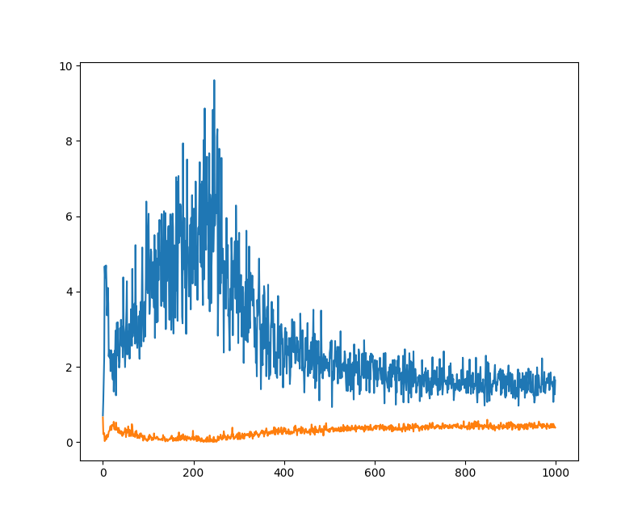
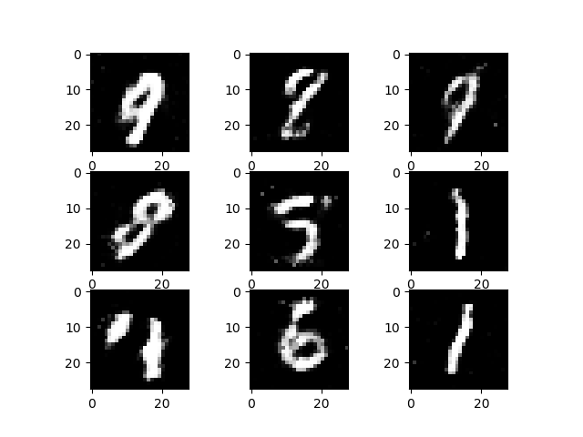
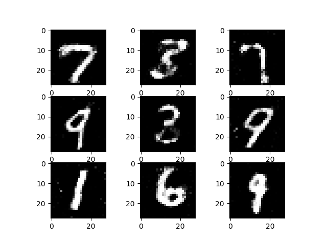

# Vanilla-GAN
---

This repository contains a simple implementation of Vanilla **Generative Adverserial Network** ([paper](https://arxiv.org/abs/1406.2661))  with the *Generator* and *Discriminator* being simple Multi-layer perceptrons. I also used the training tips-and-tricks from [this paper](https://arxiv.org/abs/1606.03498) and [this paper](https://arxiv.org/abs/1511.06434). The model is trained on MNIST digit dataset.

#### Loss curves (blue: generator; orange: discriminator)

#### Generated samples

#### How to run the code

Just execute

	python gan.py
	
Requirements:
1. PyTorch
2. Matplotlib
3. Numpy
